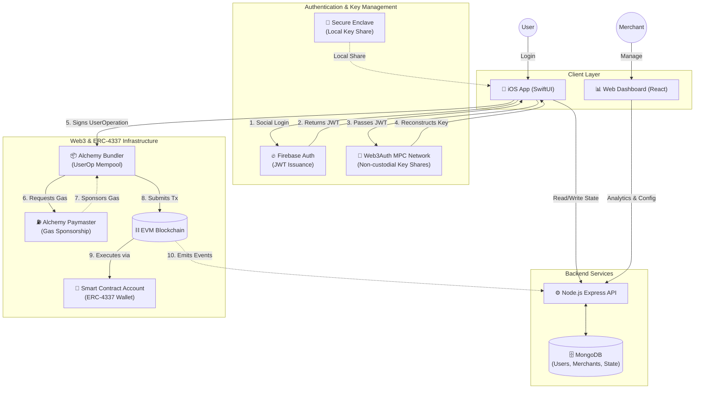

# ⚡️ PulsePay

PulsePay is a next-generation Web3 payment ecosystem that allows seamless, gasless transactions with the user experience of a traditional Web2 fintech application.

The project uses a modern web3 and mobile stack:

- **iOS Client**: SwiftUI, Web3Auth, web3swift
- **Backend**: Node.js, Express.js, MongoDB
- **Web Dashboard**: React, Vite
- **Web3 Infrastructure**: Alchemy ERC-4337 Account Abstraction Paymasters, Multi-Party Computation (MPC)

## 1. Project Overview

PulsePay strips away the complexities of blockchain technology. Users log in with standard credentials (via Firebase Auth) while a non-custodial Web3 wallet is generated behind the scenes. This enables true decentralized ownership without the hassle of seed phrases or gas fees.

Core outcomes:
- True decentralized ownership with Web2 user experience.
- Real-time balance syncing and transaction history.
- Seamless Firebase-backed JWT social logins.
- Analytics, merchant controls, and transaction monitoring via a Web Dashboard.

## 2. Problem Statement Alignment

**The Problem Statement:**
Web3 adoption is heavily hindered by the user experience. Average users struggle with the concepts of seed phrases, gas fees, and complex wallet management. Without simplifying the onboarding and transaction process, decentralized payments remain inaccessible to the mainstream audience.

**Our Solution:**
PulsePay bridges this gap by providing a frictionless, gasless Web3 payment experience wrapped in a familiar fintech interface. By utilizing Web3Auth for seamless Firebase-backed JWT social logins and Alchemy's ERC-4337 paymasters for gas abstraction, users can interact with the blockchain effortlessly.

## 3. Unique Selling Points

- **Zero Knowledge**: Private keys are generated via Multi-Party Computation (MPC) directly on the device, ensuring non-custodial ownership.
- **Gasless Infrastructure**: Transactions are routed through Alchemy's ERC-4337 Account Abstraction Paymasters, removing gas fees for the end users.
- **Environment Safety**: API Keys and Database secrets are strictly isolated.
- **Native iOS Experience**: Built with SwiftUI for a native, glassmorphic, fluid user experience.
- **Integrated Ecosystem**: Complete with an iOS client for users, a Node.js relayer backend, and a React dashboard for merchants.

## 4. Complete Architecture

The following diagram illustrates the complete technical architecture, specifically highlighting the interaction between the Web2 authentication mechanisms and the Web3 non-custodial infrastructure, as well as the ERC-4337 transaction flow.



## 5. Getting Started

### Prerequisites
- Node.js (v18+)
- MongoDB running locally or via Atlas.
- Xcode 15+ (for iOS App)

### 1. Setup Backend
```bash
cd backend
npm install
npm run dev
```
*(Ensure you have created a `.env` file in the backend directory based on `.env.example`)*

### 2. Setup Web Dashboard
```bash
cd backend/dashboard
npm install
npm run dev
```

### 3. Setup iOS App
1. Open `PulsePay.xcodeproj` in Xcode.
2. Wait for Swift Package Manager to resolve `web3swift` and `Web3Auth`.
3. Select your Simulator or physical device.
4. Hit **Run (Cmd + R)**.

## 6. Security & Web3 Native
- **Zero Knowledge**: Private keys are generated via Multi-Party Computation (MPC) directly on the device.
- **Gasless Infrastructure**: Transactions are designed to route through Alchemy's ERC-4337 Account Abstraction Paymasters.
- **Environment Safety**: API Keys and Database secrets are strictly isolated and `.gitignore` enforced.

---
*Built for the future of payments.*
